<p align="center">
  
</p>

<p align="center">
  <a href="https://www.linkedin.com/in/aruzhan-maratova-2797aa361">
    
  </a>
  <a href="https://github.com/herachxx?tab=repositories">
    
  </a>
  <a href="https://www.instagram.com/herachxx/">
    
  </a>
</p>

---

## I build where software meets the real world.

Hi, I am **Aruzhan Maratova** - a student from Aktobe, Kazakhstan, learning cybersecurity, competitive programming, drones, robotics, and embedded systems.

I am early in the journey, but serious about the craft. I like systems that make you think from multiple layers at once: code, networks, hardware, behavior, risk, and product. My goal is to become the kind of engineer and researcher who can understand a system deeply, explain it clearly, and build something useful from that understanding.

I practice security only in legal labs, CTFs, and educational environments.

---

## Current signals

| Signal | What it means |
| --- | --- |
| Security mindset | I study Linux, networking, web security, CTFs, and responsible hacking habits. |
| Builder range | I move between software, electronics, drones, robotics, and CAD instead of staying in one box. |
| Problem-solving muscle | Competitive programming keeps my algorithms, debugging, and patience sharp. |
| Research energy | I care about notes, writeups, experiments, and asking better questions. |

---

## What I am working on

- Turning CTF practice into cleaner notes, writeups, and small tools.
- Strengthening C++, Python, Kotlin, JavaScript, SQL, and Linux fundamentals.
- Building hardware experiments with Raspberry Pi, ESP32, Arduino, drones, and robotics.
- Learning how great engineers, hackers, researchers, and founders think.

---

## People I want to meet

| You are... | Let's talk about... |
| --- | --- |
| A hacker or security researcher | Labs, tooling, research habits, responsible disclosure, and real-world security thinking. |
| A programmer or open-source builder | Algorithms, code quality, project ideas, developer tools, and shipping better work. |
| A founder, CEO, or product person | Turning technical curiosity into useful products, especially in security, education, robotics, drones, and developer tools. |
| A student, maker, or CTF player | Learning in public, CTFs, electronics, robotics, and staying consistent. |

---

## Toolbox

```text
Languages      C++ / Python / Kotlin / Lua / JavaScript / SQL
Security       Linux / Bash / PowerShell / Nmap / Burp Suite / Wireshark / Metasploit
Hardware       Raspberry Pi / ESP32 / Arduino / Fusion 360 / drones / robotics
Practice       Codeforces / picoCTF / OverTheWire Bandit / Hack The Box / LeetCode
```

---

## How I want my work to feel

- Curious, but not careless.
- Ambitious, but honest.
- Technical, but understandable.
- Hacker-minded, but ethical.
- Friendly enough to start a conversation.

---

<details>
<summary><b>GitHub activity</b></summary>
<br/>

<p align="center">
  
  
</p>

</details>

---

<p align="center">
  <b>If you work on security, research, software, drones, robotics, education, or developer tools, I would be glad to meet you.</b>
</p>

<p align="center">
  <a href="https://www.linkedin.com/in/aruzhan-maratova-2797aa361">LinkedIn</a>
  / <a href="https://github.com/herachxx?tab=repositories">Repositories</a>
  / <a href="https://www.instagram.com/herachxx/">Instagram</a>
</p>

